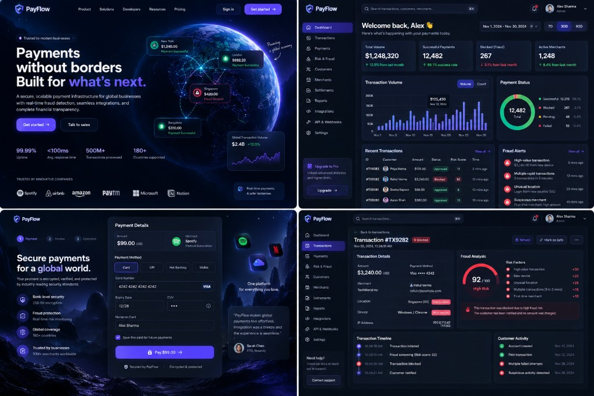

# PayFlow

**Payments without borders. Built for what's next.**

PayFlow is a portfolio-grade, full-stack fintech platform that simulates modern payment processing and rule-based fraud protection for merchants. It demonstrates production patterns used at payment companies — idempotent payment APIs, JWT auth with RBAC, double-entry ledgering, Redis rate limiting, Kafka eventing, and a premium dark-mode product UI.

> **Demo only.** No real money is processed. Card fields accept test data only. Secrets in `.env.example` are development placeholders.



---

## Tech stack

| Layer | Technologies |
|-------|----------------|
| Backend | Java 21, Spring Boot 3.3, Spring Security, Spring Data JPA, Flyway, Redis, Apache Kafka, OpenAPI, Actuator |
| Frontend | React, TypeScript, Vite, Tailwind CSS, TanStack Query, React Hook Form, Zod, Recharts, Framer Motion, Lucide |
| Data | PostgreSQL 16 |
| Infra | Docker Compose, GitHub Actions |

---

## Architecture

Modular monolith under `com.payflow.*`:

```
auth · user · merchant · customer · payment · transaction
fraud · ledger · refund · settlement · notification
webhook · api · analytics · audit · developer · event · redis · seed
```

```
React (Vite) ──REST/JWT──▶ Spring Boot
                              ├─ PostgreSQL (Flyway)
                              ├─ Redis (idempotency, rate limits, cache)
                              └─ Kafka (payment / fraud / notification events)
```

### Payment lifecycle (state machine)

```
PENDING → FRAUD_SCREENING → APPROVED | BLOCKED
APPROVED → PROCESSING → COMPLETED
COMPLETED → REFUND_PENDING → REFUNDED | PARTIALLY_REFUNDED
(+ FAILED, CANCELLED as terminal/failure paths)
```

### Fraud engine

Rule-weighted scoring (examples): high amount +30, new device +20, unusual location +20, velocity +15, first merchant +10, suspicious IP +25.

| Score | Level | Typical decision |
|------:|-------|------------------|
| 0–29 | LOW | Approve |
| 30–59 | MEDIUM | Approve |
| 60–79 | HIGH | Review / approve |
| 80+ | CRITICAL | Block |

Factors are persisted on every assessment and shown on `/transactions/:id`.

### Idempotency

`POST /api/payments` accepts `Idempotency-Key`. Redis stores a short-lived mapping; the DB also enforces uniqueness per merchant. Retries return the original payment instead of creating duplicates.

### Ledger

Completed payments post balanced double-entry rows (debit customer payable / credit merchant receivable). Refunds reverse proportionally. Debits always equal credits for a posting set.

### Kafka

Producers emit domain events (`PaymentCreated`, `PaymentBlocked`, `FraudDetected`, …). Consumers create in-app notifications and simulate webhook delivery/retries.

---

## Features

- JWT access + refresh tokens, BCrypt passwords, roles: `ADMIN`, `MERCHANT_ADMIN`, `MERCHANT_USER`, `RISK_ANALYST`
- Merchants, customers, payments, transactions, refunds, settlements
- Risk & fraud dashboard, rules, alerts
- Double-entry ledger
- Developer portal: API keys (secret shown once), webhooks
- Notifications, audit logs, analytics/reports
- Premium landing, dashboard, checkout, and transaction detail UI aligned to the design reference

---

## Quick start (Docker)

**Prerequisite:** Docker Desktop running.

```bash
cp .env.example .env
docker compose up --build
```

| Service | URL |
|---------|-----|
| Frontend (Compose) | http://localhost:3000 |
| Frontend (Vite dev) | http://localhost:5173 |
| Backend API | http://localhost:8080/api |
| Swagger UI | http://localhost:8080/swagger-ui.html |
| Actuator health | http://localhost:8080/actuator/health |

First boot runs Flyway migrations and seeds demo data (may take 1–2 minutes).

Infra uses **Apache Kafka 3.8 (KRaft)** — no ZooKeeper required.

### Demo accounts

| Email | Password | Role |
|-------|----------|------|
| admin@payflow.demo | PayFlowAdmin!2026 | ADMIN |
| merchant@payflow.demo | PayFlowMerchant!2026 | MERCHANT_ADMIN |
| risk@payflow.demo | PayFlowRisk!2026 | RISK_ANALYST |

---

## Local development

### Infrastructure only

```bash
docker compose up -d postgres redis kafka zookeeper
```

### Backend

```bash
cd backend
# JDK 21 + Maven required
mvn spring-boot:run
```

### Frontend

```bash
cd frontend
npm install
npm run dev
```

App: http://localhost:5173 — API base: `VITE_API_BASE_URL` (default `http://localhost:8080/api`).

---

## Environment variables

See [`.env.example`](.env.example). Never commit `.env`. Rotate `JWT_SECRET` for any shared environment.

---

## API overview

| Area | Examples |
|------|----------|
| Auth | `POST /api/auth/register`, `/login`, `/refresh`, `/logout` |
| Dashboard | `GET /api/dashboard` |
| Payments | `POST /api/payments` (+ `Idempotency-Key`), refunds, cancel |
| Transactions | `GET /api/transactions`, `GET /api/transactions/{id}` |
| Fraud | `GET /api/fraud/alerts`, `/rules`, `/overview` |
| Ledger | `GET /api/ledger/accounts`, `.../entries` |
| Developer | `/api/developer/api-keys`, `/api/developer/webhooks` |
| Notifications | `GET /api/notifications`, mark read |

Full OpenAPI: `/swagger-ui.html`.

---

## Testing

```bash
cd backend && mvn test
cd frontend && npm run build
```

Unit coverage includes fraud engine, payment state machine, refunds, ledger, idempotency, and auth. CI runs on push/PR via GitHub Actions (`.github/workflows/ci.yml`).

---

## Project layout

```
PayFlow/
├── backend/                 Spring Boot modular monolith
├── frontend/                React + Vite app
├── docs/                    Architecture notes & design reference
├── docker-compose.yml
├── .env.example
└── .github/workflows/ci.yml
```

---

## Security notes

- Passwords hashed with BCrypt; JWT secrets from env
- Rate-limited login; payment creation rate limits via Redis
- API key secrets hashed at rest; plaintext shown only on create
- No real card PAN storage — checkout uses test placeholders
- Role-based route protection on backend and frontend

---

## Future improvements

- Real PSP adapters (Stripe/Adyen) behind a payment gateway interface
- ML-assisted fraud scoring alongside rules
- Multi-tenant org hierarchies and SSO
- Horizontal scale with outbox pattern for Kafka
- Playwright E2E suite against Compose stack

---

## License

MIT — for portfolio / educational use.
